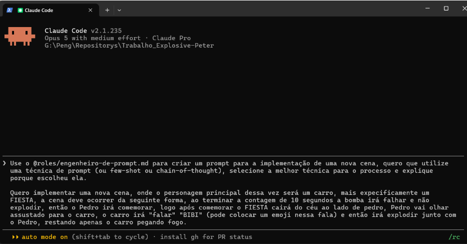
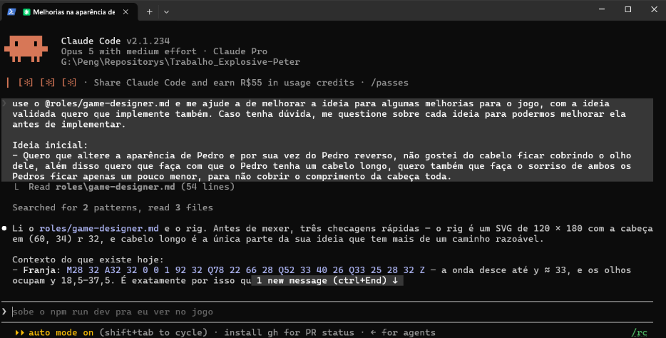
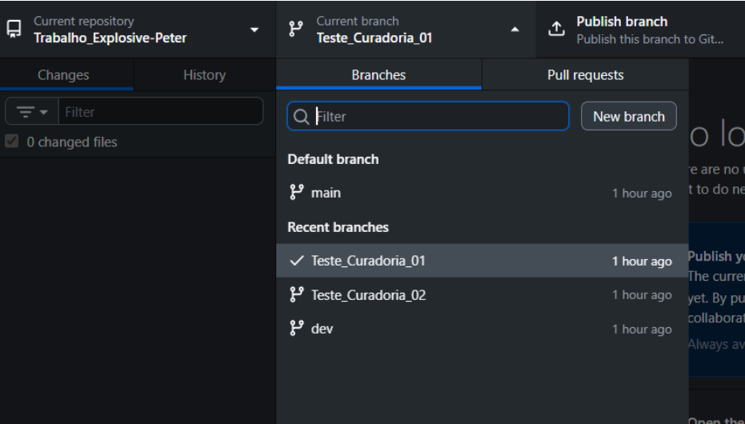
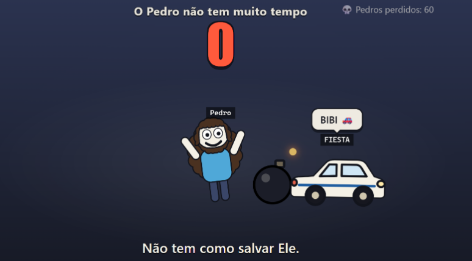
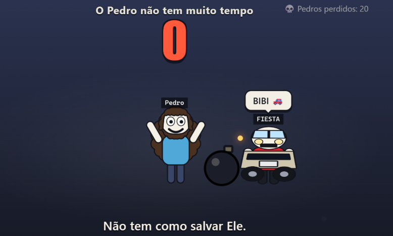
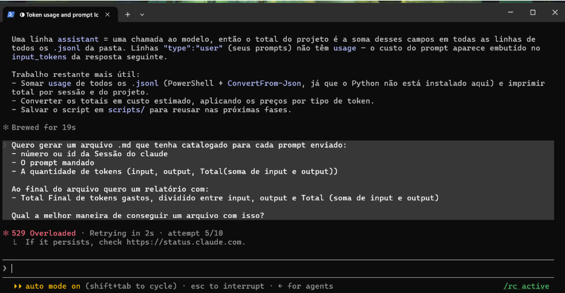

# Trabalho Prático: Tecnologias Emergentes.

## 1. Sobre o Projeto
**Opção escolhida:** Projeto de livre escolha.

## Explosive Peter
Um jogo de navegador que não espera você começar: abriu o link, o caos já começou. Um timer está correndo, Pedro está sorrindo tranquilamente e uma bomba está com o pavio aceso. Em algum momento, alguém pode aparecer para tentar salvá-lo. Quase sempre, isso é uma péssima ideia.

O objetivo não é vencer. O objetivo é descobrir quantas maneiras diferentes essa situação pode dar errado. O jogador é deliberadamente impotente, e essa é justamente a piada: a tela avisa que “não tem como salvar ele”, mas você continua clicando como se, dessa vez, fosse diferente.

Cada tentativa pode terminar de um jeito absurdo, e cada final descoberto aumenta o contador. No fim, não existe herói, não existe estratégia e, provavelmente, não existe Pedro. Só uma coleção de finais ridículos esperando para ser completada.

---

## 2. System Prompts Utilizados

Nossa abordagem não utilizou apenas um system prompt global, mas sim uma estrutura segmentada para direcionar o agente de forma eficiente. 

### System Prompt 1: Engenheiro de Prompt
Este prompt foi utilizado para estruturar a forma como o jogo deveria ser antes da geração do código. Embora concebido, este prompt não foi utilizado durante a construção final do projeto, sua função se manteve na fase de curadoria do projeto.
> 📄 **Arquivo:** [`engenheiro-de-prompt.md`](roles/engenheiro-de-prompt.md)
### System Prompt 2: Game-Designer
Este agente foi o responsável por receber as diretrizes de design e gerar tanto a narrativa (personagens/finais) quanto o código final da aplicação.
> 📄 **Arquivo:** [`game-designer.md`](roles/game-designer.md)


**Evidência dos Agentes:**

 

---

## 3. Técnica de Prompt Engineering: Few-Shot

**Justificativa:** 
Para garantir a consistência na comunicação com o game-designer, foram fornecidos exemplos práticos da estrutura esperada para as respostas. Como o jogo depende de um formato específico `{personagem, cena, final}`, essas referências ajudaram a orientar a IA na geração dos dados e do código, evitando respostas despadronizadas e facilitando a integração com a aplicação final.
 
### Exemplos e Estruturas

Para guiar a geração do conteúdo, padronizamos as cenas e características dos personagens com a seguinte estrutura de dados:

**Cenas e Finais Possíveis:**

```json
[
  {
    "personagem": "Vinicius - O Estoico",
    "cena": "Antes da bomba explodir, Vinicius chega e segura a bomba de maneira estoica.",
    "final": "Vinícius diz frases de efeito e impede a explosão com as mãos."
  },
  {
    "personagem": "Vinicius - O Estoico",
    "cena": "Antes da bomba explodir, Vinicius chega e segura a bomba de maneira estoica.",
    "final": "Percebe que não conseguirá impedir a explosão, se sacrificando pelo Pedro, dizendo frases de efeito."
  }

[
  {	
    "personagem": "Michas dos Mares", 
    "caracteristicas": "Referência a Minecraft, comanda os mares com um tridente."
  },
  {	
    "personagem": "Vinicius - O Estoico", 
    "caracteristicas": "Extremamente estoico, calmo diante do perigo, SEMPRE solta frases de efeito."
  },
  {	
    "personagem": "Pedro Maligno", 
    "caracteristicas": "O Pedro de um universo paralelo, com aparência maligna."
  },
  {	
    "personagem": "JP from the South", 
    "caracteristicas": "Anão bravo, sempre vem debaixo da tela até o Pedro."
  }
]

]
```

---

## 4. Teste de Curadoria de Contexto

Para testar o consumo de tokens com diferentes tamanhos de contexto, solicitamos à IA uma alteração específica (ex: adicionar a implementação de uma segunda cena/personagem) de duas formas diferentes:

*   **Versão A: Solicitação direta ao game-designer, utilizando o contexto e as instruções já definidas para o projeto.**   
*   **Versão B: Solicitação ao prompt-engineer, responsável por estruturar o pedido e orientar a geração da nova cena utilizando exemplos e/ou raciocínio estruturado.**

**Comparação de Consumo:**
*   **Tokens Versão A:** **[Relatório de custo](/docs/relatorio_curadoria_01.md)**
*   **Tokens Versão B:** **[Relatório de custo](/docs/relatorio_curadoria_02.md)**

**Evidência do Teste:**



  

## Resultado dos Testes:

**Versão A -**



**Versão B -**


---

## 5. Tabela de Chamadas e Custos

*Ferramenta utilizada:* Claude Code

*Fórmula utilizada:* `(tokens_input / 1_000_000) * preco_input + (tokens_output / 1_000_000) * preco_output`

### Relátorios de custos por integrante

**Felipe Barreto: [Relatório de custo](/docs/relatorio-tokens.md)**

**Vinicius Reginaldo: [Relatório de custo](/docs/relatorio-tokens-vinicius.md)**


---

## 6. Evidências de Consumo (Dashboard/Logs)

Abaixo estão os registros do terminal e os logs locais de transcript utilizados para verificar o consumo de tokens apresentado na tabela acima. O registro também evidencia uma indisponibilidade momentânea do Claude Code durante a execução.

> 

---

## 7. URL Publicada

O projeto foi publicado via GitHub Pages e está funcional no link abaixo:

🔗 [▶ Jogar](https://felipepeng.github.io/Trabalho_Explosive-Peter/)

🔗[Link Canva](https://canva.link/i3qq2ndkce1vgnj)

---

## 8. Integrantes do Grupo

*   **Pedro Alvaro Mantuani Silva** - RA: 23079477-2 
*   **Felipe Barreto Cortes** - RA: 23069437-2 
*   **Vinicius Reginaldo Ferrarini** - RA: 23159293-2 

